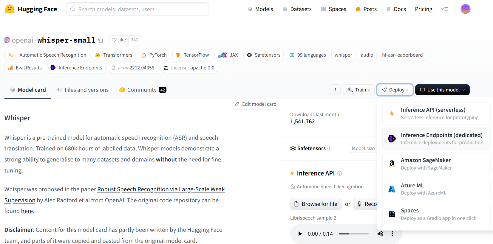
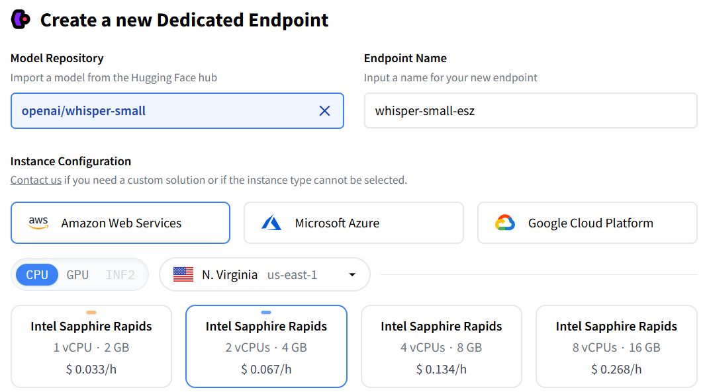
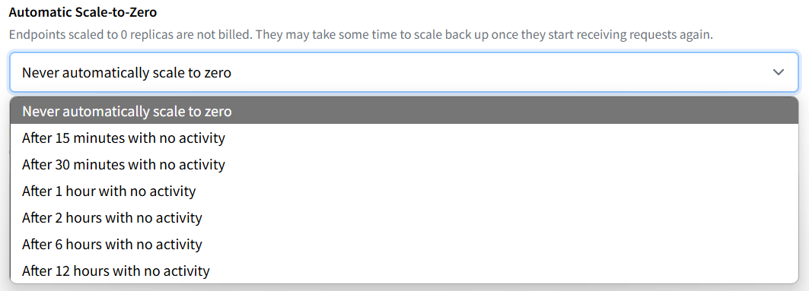
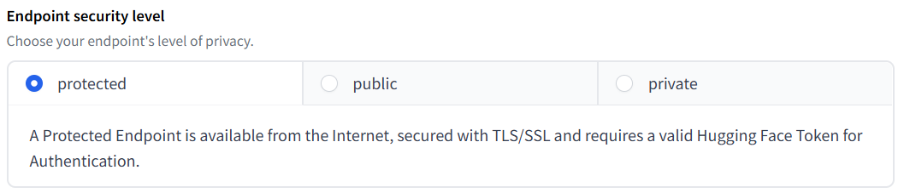
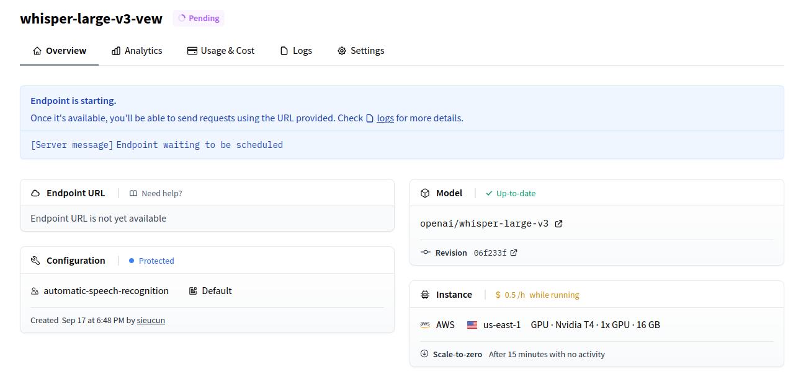
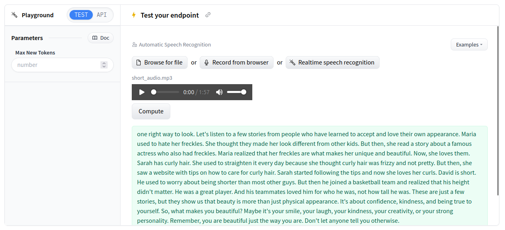

# Introduction to Huggingface Inference Endpoint
    
**Hugging Face** is a company and open-source community that focuses on natural language processing (NLP) technologies. They are renowned for their contributions to NLP with the Transformers library, which provides easy-to-use APIs and pre-trained models for a wide range of NLP tasks.

**Hugging Face Model Hub** provide a various pretrained model for various task, make it become an important platform for every developer. For example, if you want to use Whisper pretrained model from OpenAI for your ASR task, you can using: 

```python
# Use a pipeline as a high-level helper
from transformers import pipeline

pipe = pipeline("automatic-speech-recognition", model="openai/whisper-large-v3")
```

**Hugging Face Inference Endpoints:** To bring our model to production, Hugging Face Inference Endpoints allow developers to deploy machine learning models quickly and efficiently, particularly those hosted on the Hugging Face Model Hub. This service simplifies the process of turning pre-trained models into production-ready APIs with just a few clicks. With minimal setup, you can deploy any model from the Hugging Face Hub to a cloud provider like AWS, GCP, or Azure.

# Hugging Face Inference Endpoints with Whisper model

Let’s take an example of how to deploy a Whisper model to a Hugging Face Inference Endpoint.

In the Hugging Face Model Repository, navigate to your desired model, then go to Deploy and select Inference Endpoint.



On the Inference Endpoints page, you'll see the openai/whisper-large-v3 model that we selected from the Hub. You can also choose a different model for your endpoint here. Give your endpoint a name of your choice.

## Instance Configuration

## Cloud vendor
In the Instance Configuration section, you can choose your preferred cloud vendor, including AWS, Microsoft Azure, or GCP. You can also select the instance that best matches your requirements. Be sure to review its details and pricing.


Automatic Scale-to-Zero can shut down your endpoint after a period of inactivity, which helps reduce costs. However, it may take some time to scale back up when needed.


The Endpoint security level is the most important setting for your endpoint. There are three options; choose the one that best suits your needs:

- Public: The endpoint is publicly accessible on the internet, and no authentication is required.

- Protected: The endpoint is created in a public subnet managed by Hugging Face, but access requires a Hugging Face token.

- Private: The endpoint is only accessible through an intra-region secured AWS PrivateLink connection, and it is not available from the internet.



You can also configure parameters such as the number of replicas, container type, environment variables, and revision under Advanced Configuration. Be sure to check it out.

## Usage
Here, we will create an example openai/whisper-large-v3 endpoint using AWS with a T4 GPU. It will take a few minutes to create the endpoint. 
 

Once it's ready, you can test it in the playground.


An important way to integrate the endpoint into a product is by accessing it via API. To use a protected Inference Endpoint, you'll need to provide your Hugging Face Access Token, as shown below:
```python
import requests
API_URL = "https://r0rl95p5bkd64d5d.us-east-1.aws.endpoints.huggingface.cloud"
headers = {
	"Accept" : "application/json",
	"Authorization": "Bearer hf_XXX",
	"Content-Type": "audio/wav" 
}

def query(filename):
	with open(filename, "rb") as f:
		data = f.read()
	response = requests.post(API_URL, headers=headers, data=data)
	return response.json()

output = query("./test_audio.wav")
print(output)
```
Output:
```
{'text': ' Printing, in the only sense with which we are at present concerned, differs from most, if not from all, the arts and crafts represented in the exhibition'}
```

# 2. Custom HuggingFace Inference Endpoint

In the previous section, we introduced how to create and use an endpoint for a model in the Hugging Face Model Hub. However, with a default model, you can only perform one task per API. In some scenarios, you may want to perform multiple tasks or features within a single API, such as ASR and diarization. In this section, we will explain how to create a custom Inference Endpoint to support your desired features.

First, create your own model. Then, go to File and Versions. There are two important files you need to manage:

- handler.py: This file defines the flow of your endpoint.
- config.py: This file retrieves environment variables for your endpoint and sets inference parameters.

Additionally, include any dependency libraries in requirements.txt and other files as needed for your project. For example, the diarization processor will be placed in diarization_utils.py.

Here is our `config.py` file:
```python
import logging

from pydantic import BaseModel
from pydantic_settings import BaseSettings
from typing import Optional, Literal

logger = logging.getLogger(__name__)

class ModelSettings(BaseSettings):
    asr_model: str
    assistant_model: Optional[str]
    diarization_model: Optional[str]
    hf_token: Optional[str]


class InferenceConfig(BaseModel):
    task: Literal["transcribe", "translate"] = "transcribe"
    batch_size: int = 24
    assisted: bool = False
    chunk_length_s: int = 30
    sampling_rate: int = 16000
    language: Optional[str] = None
    num_speakers: Optional[int] = None
    min_speakers: Optional[int] = None
    max_speakers: Optional[int] = None

model_settings = ModelSettings()
```

In `handler.py` file, we need to focus on 2 function of `class EndpointHandler()`.

`__init__` function will initialize our model base on the parameter in ModelSetting
```python
def __init__(self, path=""):

        device = torch.device("cuda") if torch.cuda.is_available() else torch.device("cpu")
        logger.info(f"Using device: {device.type}")
        torch_dtype = torch.float32 if device.type == "cpu" else torch.float16

        self.assistant_model = AutoModelForCausalLM.from_pretrained(
            model_settings.assistant_model,
            torch_dtype=torch_dtype,
            low_cpu_mem_usage=True,
            use_safetensors=True
        ) if model_settings.assistant_model else None

        if self.assistant_model:
            self.assistant_model.to(device)

        self.asr_pipeline = pipeline(
            "automatic-speech-recognition",
            model=model_settings.asr_model,
            torch_dtype=torch_dtype,
            device=device
        )

        if model_settings.diarization_model:
            # diarization pipeline doesn't raise if there is no token
            HfApi().whoami(model_settings.hf_token)
            self.diarization_pipeline = Pipeline.from_pretrained(
                checkpoint_path=model_settings.diarization_model,
                use_auth_token=model_settings.hf_token,
            )
            self.diarization_pipeline.to(device)
        else:
            self.diarization_pipeline = None
```

Otherwise, `__call__` will handle inference request, and create the model workflow.
```
def __call__(self, inputs):
        file = inputs.pop("inputs")
        file = base64.b64decode(file)
        parameters = inputs.pop("parameters", {})
        try:
            parameters = InferenceConfig(**parameters)
        except ValidationError as e:
            logger.error(f"Error validating parameters: {e}")
            raise HTTPException(status_code=400, detail=f"Error validating parameters: {e}")
            
        logger.info(f"inference parameters: {parameters}")

        generate_kwargs = {
            "task": parameters.task, 
            "language": parameters.language,
            "assistant_model": self.assistant_model if parameters.assisted else None
        }

        try:
            asr_outputs = self.asr_pipeline(
                file,
                chunk_length_s=parameters.chunk_length_s,
                batch_size=parameters.batch_size,
                generate_kwargs=generate_kwargs,
                return_timestamps=True,
            )
        except RuntimeError as e:
            logger.error(f"ASR inference error: {str(e)}")
            raise HTTPException(status_code=400, detail=f"ASR inference error: {str(e)}")
        except Exception as e:
            logger.error(f"Unknown error diring ASR inference: {str(e)}")
            raise HTTPException(status_code=500, detail=f"Unknown error diring ASR inference: {str(e)}")

        if self.diarization_pipeline:
            try:
                transcript = diarize(self.diarization_pipeline, file, parameters, asr_outputs)
            except RuntimeError as e:
                logger.error(f"Diarization inference error: {str(e)}")
                raise HTTPException(status_code=400, detail=f"Diarization inference error: {str(e)}")
            except Exception as e:
                logger.error(f"Unknown error during diarization: {str(e)}")
                raise HTTPException(status_code=500, detail=f"Unknown error during diarization: {str(e)}")
        else:
            transcript = []

        return {
            "speakers": transcript,
            "chunks": asr_outputs["chunks"],
            "text": asr_outputs["text"],
        }
```

